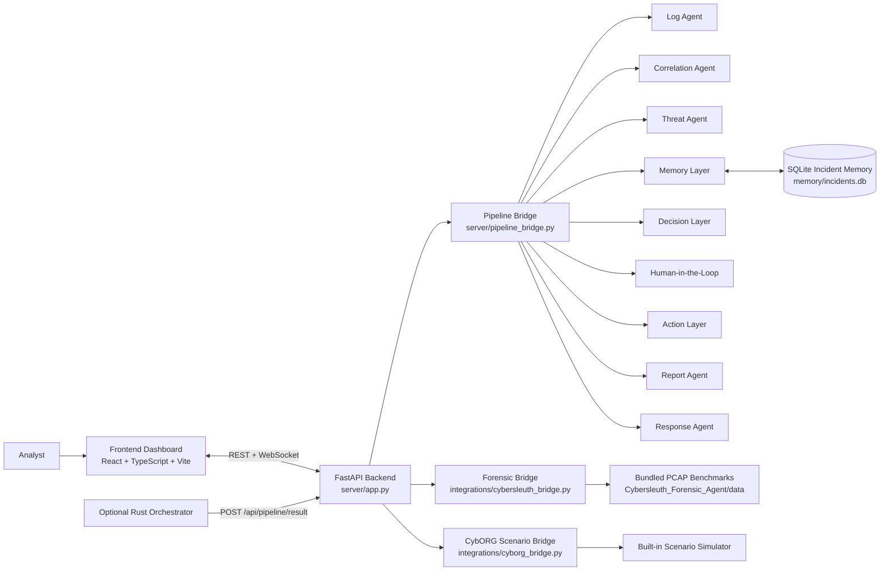
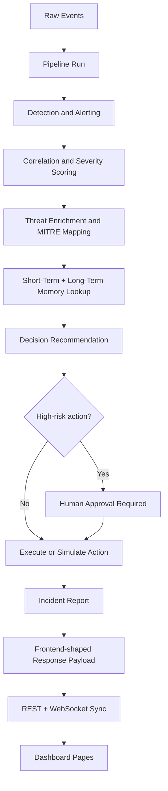

# CyberSaviour

CyberSaviour is an agentic AI Security Operations Center (SOC) prototype built for the DS308 Data Security and Privacy course project. It combines real-time event triage, multi-agent incident reasoning, long-term security memory, forensic PCAP analysis, attack-defense simulation, and a gamified analyst dashboard into one end-to-end platform.

Detailed course report: [PROJECT_REPORT_DS308.md](PROJECT_REPORT_DS308.md)

## Table of Contents

- [What This Project Does](#what-this-project-does)
- [Core Capabilities](#core-capabilities)
- [Architecture](#architecture)
- [Pipeline Flow](#pipeline-flow)
- [Tech Stack](#tech-stack)
- [Repository Layout](#repository-layout)
- [Prerequisites](#prerequisites)
- [Installation](#installation)
- [Configuration](#configuration)
- [Running the Project](#running-the-project)
- [How to Use the Platform](#how-to-use-the-platform)
- [API Overview](#api-overview)
- [Data and Persistence](#data-and-persistence)
- [Development Notes](#development-notes)
- [Known Limitations](#known-limitations)
- [Future Improvements](#future-improvements)

## What This Project Does

Modern SOC workflows are noisy, fragmented, and often manually intensive. CyberSaviour is designed as a unified workflow where raw events become analyst-facing incidents through a staged pipeline:

1. Detect suspicious activity from incoming events.
2. Correlate repeated or related behavior.
3. Enrich incidents with threat intelligence and MITRE ATT&CK context.
4. Recall historical incidents from persistent memory.
5. Recommend a response.
6. Pause for human approval when the action is high risk.
7. Generate an incident report and push updates to the dashboard in real time.

The system also includes:

- forensic investigation using bundled benchmark PCAP datasets
- CybORG-inspired cyber attack simulation
- a React dashboard with missions, XP, streaks, achievements, and analyst workflows

## Core Capabilities

- Multi-agent SOC pipeline with dedicated stages for detection, correlation, threat enrichment, memory, decisioning, action, and reporting
- FastAPI backend with REST APIs and WebSocket updates
- React + TypeScript frontend for live SOC visualization
- SQLite-backed long-term memory for historical incident recall
- Human-in-the-loop approval for risky actions like blocking or isolation
- Forensic analysis bridge that extracts metadata from PCAPs using Scapy
- CybORG-compatible scenario simulator for training and demo traffic generation
- Gamified UX with missions, ranks, XP, achievements, and squad-style agent views
- Graceful fallback behavior when LLM enrichment is unavailable or rate-limited

## Architecture

### High-Level System Architecture



### Runtime Data Flow



## Pipeline Flow

The main backend pipeline lives across `cyberSaviour/agents`, `cyberSaviour/memory`, and `cyberSaviour/pipeline`.

```text
Raw Events
  -> LogAgent
  -> CorrelationAgent
  -> ThreatAgent
  -> MemoryLayer
  -> DecisionLayer
  -> HumanInLoop
  -> ActionLayer
  -> ReportAgent
  -> ResponseAgent
```

### Stage Responsibilities

| Stage | Purpose |
|---|---|
| Log Agent | Converts raw events into initial alerts such as failed login, SQL injection, recon, and suspicious network activity |
| Correlation Agent | Groups related events by source and behavior, computes threat score and severity |
| Threat Agent | Adds MITRE ATT&CK-style context and higher-level threat interpretation |
| Memory Layer | Writes incidents to SQLite and recalls recent or repeat-offender history |
| Decision Layer | Chooses a recommended response and decides whether human approval is needed |
| Human-in-the-Loop | Holds sensitive actions for analyst review |
| Action Layer | Simulates or records action execution |
| Report Agent | Produces structured incident reports |
| Response Agent | Shapes final analyst-facing response data for the dashboard |

## Tech Stack

### Backend

- Python
- FastAPI
- Uvicorn
- SQLite
- Scapy
- WebSockets
- Google Gemini integration with retry logic and fallback behavior

### Frontend

- React 18
- TypeScript
- Vite
- Zustand
- TanStack Query
- Tailwind CSS
- shadcn-style component structure
- Framer Motion
- Three.js / React Three Fiber

### Simulation and Forensics

- CybORG-inspired scenario simulation bridge
- Bundled forensic benchmark datasets in `Cybersleuth_Forensic_Agent/data`
- Scapy-based packet metadata extraction

### Optional / Advanced

- Rust orchestrator under `cyberSaviour/orchestrator`

## Repository Layout

```text
.
|-- cyberSaviour/
|   |-- agents/                  # Detection, threat, response, report, LLM helpers
|   |-- ingestion/               # Event parsing and sample log inputs
|   |-- integrations/            # CybORG and Cybersleuth bridges
|   |-- memory/                  # Short-term + SQLite-backed long-term memory
|   |-- orchestrator/            # Optional Rust worker/orchestrator
|   |-- pipeline/                # Decision, HITL, action stages
|   |-- server/                  # FastAPI app, API routes, WebSocket manager
|   `-- main.py                  # CLI pipeline demo runner
|-- frontend/                    # Analyst dashboard
|-- Cybersleuth_Forensic_Agent/  # Benchmark datasets and forensic agent assets
|-- CybORG/                      # Vendored CybORG assets and references
|-- docs/                        # Supporting notes and references
|-- PROJECT_REPORT_DS308.md      # Full academic report
|-- README.md
`-- requirements.txt             # Python dependencies for the integrated backend
```

## Prerequisites

Install these before running the full platform:

- Python 3.10 or newer
- Node.js 18 or newer
- npm

Optional:

- Rust toolchain if you want to work with `cyberSaviour/orchestrator`
- A Gemini API key if you want live LLM enrichment instead of fallback-only behavior

## Installation

### 1. Clone the repository

```bash
git clone <your-repo-url>
cd Buildathon_Room_105
```

### 2. Create a Python virtual environment

Windows PowerShell:

```powershell
python -m venv .venv
.venv\Scripts\Activate.ps1
```

macOS/Linux:

```bash
python3 -m venv .venv
source .venv/bin/activate
```

### 3. Install backend dependencies

Run this from the repository root:

```bash
pip install -r requirements.txt
```

### 4. Install frontend dependencies

```bash
cd frontend
npm install
cd ..
```

## Configuration

The project can run in a mostly local/demo mode without heavy configuration, but these settings are useful.

### Environment Variables

Create a `.env` file in the repository root if you want optional LLM enrichment:

```env
API=your_gemini_api_key_here
VITE_API_BASE_URL=http://localhost:8000
```

### What These Variables Do

| Variable | Required | Purpose |
|---|---|---|
| `API` | No | Gemini API key used by `cyberSaviour/agents/god/llm.py` for threat and forensic enrichment |
| `VITE_API_BASE_URL` | No | Frontend API base URL. Defaults to `http://localhost:8000` |

### Important Defaults

- Backend runs on `http://localhost:8000`
- Frontend Vite dev server runs on `http://localhost:8080`
- WebSocket endpoint is `ws://localhost:8000/ws`
- SQLite incident memory is stored at `cyberSaviour/memory/incidents.db`

## Running the Project

### Start the backend

Important: run backend commands from inside `cyberSaviour/`, because some imports assume that working directory.

```bash
cd cyberSaviour
uvicorn server.app:app --reload --port 8000
```

Alternative CLI demo runner:

```bash
cd cyberSaviour
python main.py
```

### Start the frontend

In a second terminal:

```bash
cd frontend
npm run dev
```

Then open:

```text
http://localhost:8080
```

### Verify the backend is up

```bash
curl http://localhost:8000/health
```

Expected shape:

```json
{
  "status": "healthy",
  "timestamp": "..."
}
```

## How to Use the Platform

### 1. Run a demo SOC pipeline

The frontend can trigger demo scenarios, but you can also call the pipeline directly:

```bash
curl -X POST http://localhost:8000/api/pipeline/run \
  -H "Content-Type: application/json" \
  -d "{\"events\":[{\"source_ip\":\"192.168.1.5\",\"event_type\":\"failed_login\",\"raw\":\"Failed password from 192.168.1.5\",\"protocol\":null}]}"
```

### 2. Explore the dashboard pages

The frontend routes include:

- `/dashboard`
- `/missions`
- `/incidents/:id`
- `/squad`
- `/agents`
- `/response`
- `/codex`
- `/cyborg`
- `/forensic`
- `/status`

### 3. Run a CybORG-style scenario

List scenarios:

```bash
curl http://localhost:8000/api/cyborg/scenarios
```

Run one:

```bash
curl -X POST http://localhost:8000/api/cyborg/run-scenario \
  -H "Content-Type: application/json" \
  -d "{\"scenario_name\":\"Scenario1\",\"num_steps\":20}"
```

### 4. Run a forensic benchmark analysis

List available forensic events:

```bash
curl "http://localhost:8000/api/forensic/events?benchmark=CFA"
```

Analyze an event:

```bash
curl -X POST http://localhost:8000/api/forensic/analyze \
  -H "Content-Type: application/json" \
  -d "{\"event_id\":\"0\",\"benchmark\":\"CFA\"}"
```

### 5. Review and approve actions

If the decision layer marks an action as high risk, the backend creates a pending response action. Approve or reject it with:

```bash
curl -X POST http://localhost:8000/api/response-actions/<ACTION_ID>/decision \
  -H "Content-Type: application/json" \
  -d "{\"decision\":\"approved\"}"
```

or

```bash
curl -X POST http://localhost:8000/api/response-actions/<ACTION_ID>/decision \
  -H "Content-Type: application/json" \
  -d "{\"decision\":\"rejected\"}"
```

## API Overview

### Core and Health

| Endpoint | Method | Purpose |
|---|---|---|
| `/health` | `GET` | Basic backend health check |
| `/api/status` | `GET` | Unified status for pipeline, integrations, and game stats |
| `/ws` | `GET` WebSocket | Real-time state sync to the frontend |

### Game and Dashboard State

| Endpoint | Method | Purpose |
|---|---|---|
| `/api/game-state` | `GET` | Current XP, rank, streak, and achievement state |
| `/api/achievements` | `GET` | Achievement list |
| `/api/missions` | `GET` | Active missions |
| `/api/missions/{mission_id}/complete` | `POST` | Mark a mission complete and award XP |
| `/api/demo/reset` | `POST` | Reset in-memory dashboard/demo state |

### Pipeline Data

| Endpoint | Method | Purpose |
|---|---|---|
| `/api/pipeline/run` | `POST` | Run the full pipeline on supplied events |
| `/api/pipeline/result` | `POST` | Ingest pre-shaped pipeline output from the optional orchestrator |
| `/api/alerts` | `GET` | Current alerts |
| `/api/incidents` | `GET` | Current incidents |
| `/api/agents` | `GET` | Agent state cards |
| `/api/response-actions` | `GET` | Pending and executed response actions |
| `/api/memory` | `GET` | Memory entries surfaced to the UI |
| `/api/responses` | `GET` | Final response payloads |

### Human Approval

| Endpoint | Method | Purpose |
|---|---|---|
| `/api/response-actions/{action_id}/decision` | `POST` | Approve or reject a pending action |

### CybORG Simulation

| Endpoint | Method | Purpose |
|---|---|---|
| `/api/cyborg/scenarios` | `GET` | List available simulated scenarios |
| `/api/cyborg/run-scenario` | `POST` | Run a scenario and feed its events through the main pipeline |

### Forensic Analysis

| Endpoint | Method | Purpose |
|---|---|---|
| `/api/forensic/events` | `GET` | List available forensic benchmark events |
| `/api/forensic/analyze` | `POST` | Run synchronous forensic analysis |
| `/api/forensic/analyze/async` | `POST` | Start async forensic analysis job |
| `/api/forensic/jobs` | `GET` | List forensic jobs |
| `/api/forensic/jobs/{job_id}` | `GET` | Poll a forensic job result |

## Data and Persistence

### In-Memory vs Persistent State

The platform uses both volatile and persistent storage:

- Alerts, incidents, actions, missions, and response payloads are stored in backend memory while the server is running
- Historical incident memory is persisted in SQLite at `cyberSaviour/memory/incidents.db`
- Forensic benchmark data is bundled in the repository under `Cybersleuth_Forensic_Agent/data`

### Memory Model

CyberSaviour uses:

- short-term memory for current-session context
- long-term memory for historical incident recall
- repeat-offender tracking by IP
- recall of recent incidents for decision support

## Development Notes

### Frontend/Backend Wiring

- Frontend default API base: `http://localhost:8000`
- Frontend dev server port: `8080`
- Backend CORS is configured to allow localhost origins
- WebSocket client connects to `/ws`

### Forensic Integration Notes

The integrated forensic bridge:

- reads bundled benchmark metadata
- parses PCAPs with Scapy
- extracts attacker/victim IPs, ports, protocols, flow counts, and suspicious payload snippets
- optionally asks Gemini for a forensic narrative
- falls back to a rule-based report if the LLM is unavailable

### CybORG Integration Notes

The project includes a CybORG-inspired simulator instead of directly relying on upstream runtime compatibility. The bridge explicitly documents that this is because the vendored CybORG environment is not directly compatible with the NumPy version used by the current Python stack.

### Optional Rust Orchestrator

`cyberSaviour/orchestrator` exists as an optional path for pushing pre-shaped pipeline results into the FastAPI backend through `/api/pipeline/result`. The default local workflow does not require it.

## Known Limitations

- This is a prototype platform, not a production SOC deployment
- Most dashboard state is in memory and resets when the backend restarts
- Response execution is simulated rather than wired into real firewalls, SIEMs, or EDR tools
- Authentication and role-based access control are not yet implemented for multi-user use
- Privacy hardening such as redaction, retention controls, and encryption at rest is still limited
- Some LLM features depend on a Gemini key and may fall back when quota is exhausted
- The CybORG integration uses a compatibility simulator rather than full upstream runtime execution

## Future Improvements

- production-grade authentication and analyst roles
- encrypted or pseudonymized telemetry storage
- retention policies and privacy-aware redaction
- integration with SIEM/EDR tools
- stronger benchmark-based evaluation metrics
- richer live ingestion connectors
- policy-driven automated response with stronger safeguards
- cloud deployment and multi-user collaboration features

## Project Summary

CyberSaviour brings together SOC automation, forensic analysis, simulation, and analyst oversight in a single educational platform. The backend pipeline, persistent memory, real-time frontend, CybORG-style simulation, and PCAP investigation flow are all present in this repository and can be run locally with a Python backend and Vite frontend.

For the academic write-up and course-oriented explanation, see [PROJECT_REPORT_DS308.md](PROJECT_REPORT_DS308.md).
